<p align="center">
  
</p>

<p align="center">
  
  
  
</p>

<h3 align="center">96,478 orders: orders that arrived late scored 2.27 stars against 4.29 on time,<br>and the top 10% of sellers brought 67% of revenue.</h3>

A Power BI report built end to end, with no database: one Python notebook checks and cleans the input files and
writes a star schema, and Power BI adds 23 DAX measures, five pages and row-level security by region. The notebook
computes every number first, so the report can be checked against it.

Every client value (names, file and column names, rules, colours) lives in `config/client.yaml` and the input files
in `data/input/`.

## The problem

An online marketplace sells through about three thousand independent sellers. Orders, items, sellers, customers and
reviews come out as separate exports, so nobody can answer on one page:

- Are we growing against last year?
- What sells, and who sells it?
- What do late deliveries cost us in customer reviews?

Every report starts with a day of cleaning, and the totals never agree.

## 🛠️ The solution

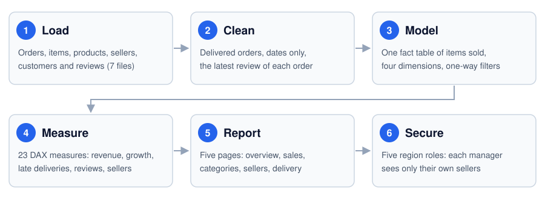

One model answers five questions: when, what sold, who sold it, who bought it, and how the order went. Each
dimension answers one of them; the fact table in the middle answers the last.

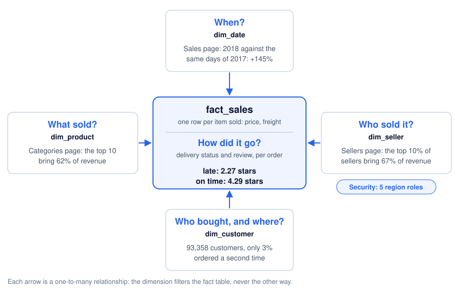

## 📈 What the numbers say

| | |
|---|---|
| Revenue (delivered orders, Sep 2016 to Aug 2018) | 13,221,498 from 96,478 orders and 93,358 customers |
| Growth | 2018 revenue up **145.1%** on the same days of 2017 (7.22M against 2.94M) |
| Late deliveries | **6.8%** of orders arrived after the estimated date |
| What late costs | late orders average **2.27** stars against **4.29** on time; **54%** of late orders get 1 star, against 7% on time |
| Seller concentration | the top 10% of sellers (297 of 2,970) bring **67.1%** of revenue |
| Category concentration | the top 10 of 74 categories bring **62.4%** of revenue |
| Repeat buyers | only **3.0%** of customers ordered a second time |

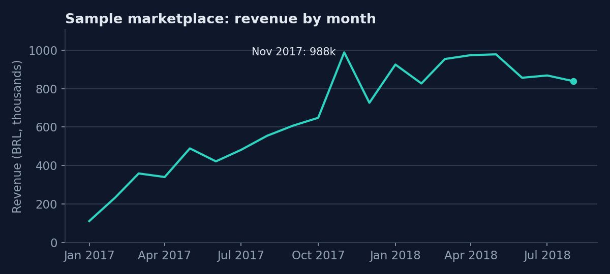

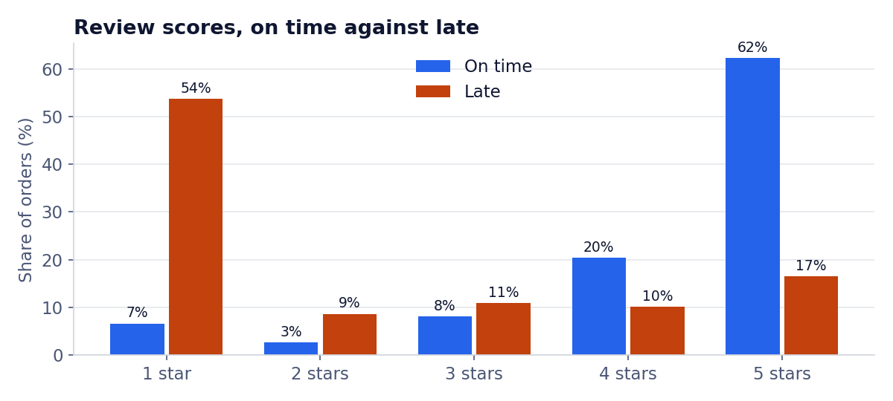

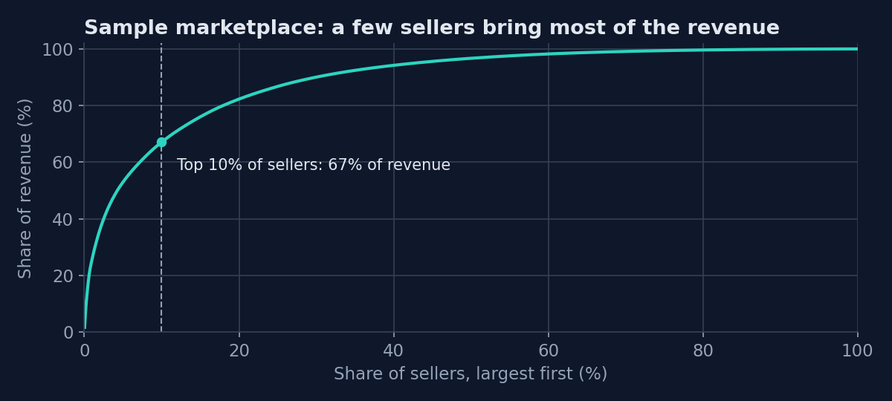

What a manager does with it:

1. **Fix late deliveries first.** They are 6.8% of orders but more than half of them end in a 1-star review.
   The Sellers page shows which sellers deliver late most often; the Delivery page shows the states where orders
   arrive late most (AL: 21.4%).
2. **Look after the top 297 sellers.** Two thirds of revenue depends on them.
3. **Win the second order.** With 3% of customers coming back, almost all growth is paid for with new customers.

These are patterns in the data, not proven causes: the report shows where to look.

## 📊 The report

| Page | Question it answers |
|---|---|
| Overview | How is the business doing overall? |
| Sales | Are we growing against last year, and where? |
| Categories | What sells? |
| Sellers | Who sells, and which sellers hurt the customer experience? |
| Delivery | How much does late delivery cost us in reviews? |

Five security roles (one per region) limit each regional manager to their own sellers.

The report is [`powerbi/sales-performance.pbip`](powerbi/README.md): open it in Power BI Desktop and click
**Refresh now**. It is written by `powerbi/build_pbip.py` from the build pack in [`powerbi/`](powerbi/README.md), which
also lets you build it by hand: every Power Query step, the model, every measure, every visual with its position and
fields, the theme, and the numbers each page must show. All 43 checks were run against the model in Power BI Desktop.

### 📸 Screenshots

**Overview:** revenue, orders, customers, late deliveries and reviews at a glance.

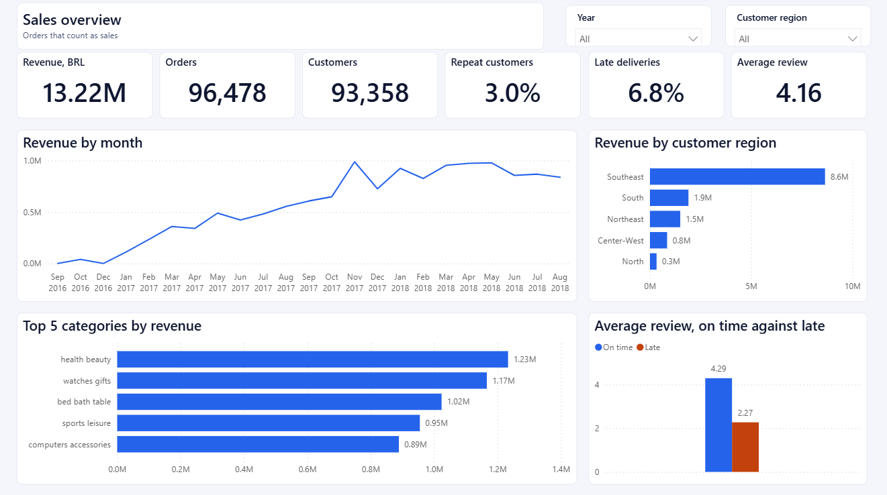

**Sales:** 2018 against the same days of 2017, month by month and by state.

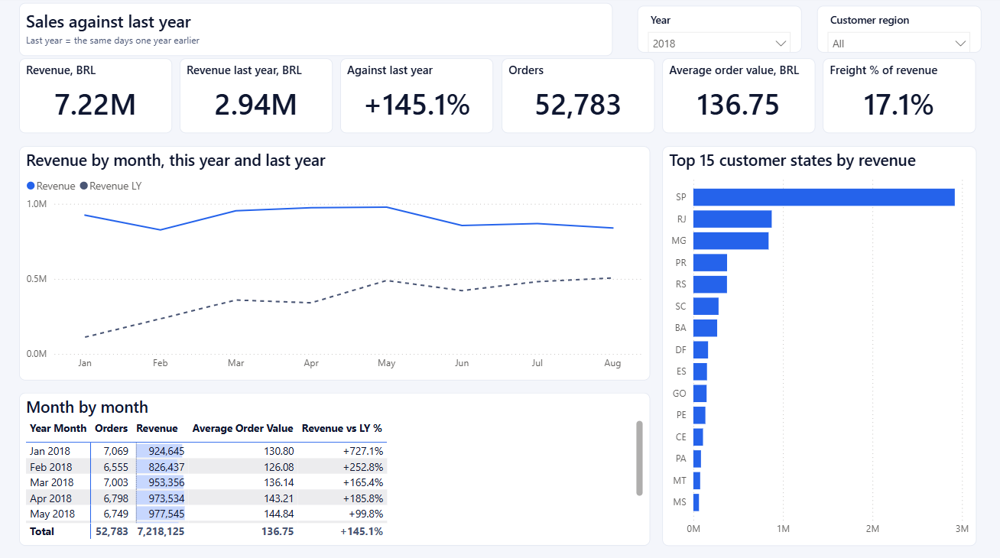

**Categories:** what sells, and which categories review badly or arrive late.

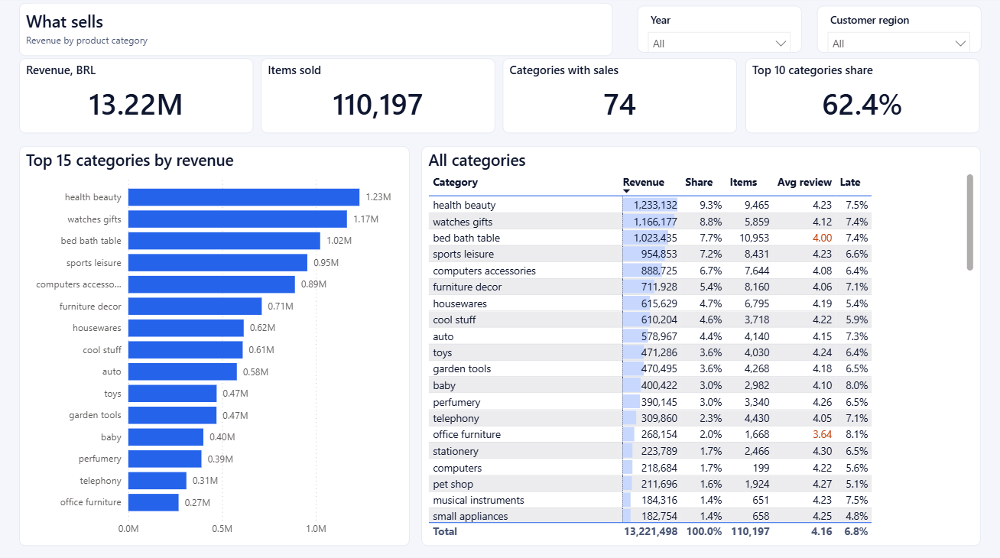

**Sellers:** the sellers behind the revenue, and those who deliver late and review badly.

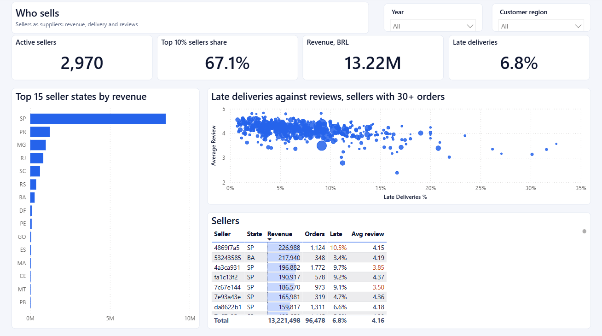

**Delivery:** how late delivery drags reviews down, and where it happens.

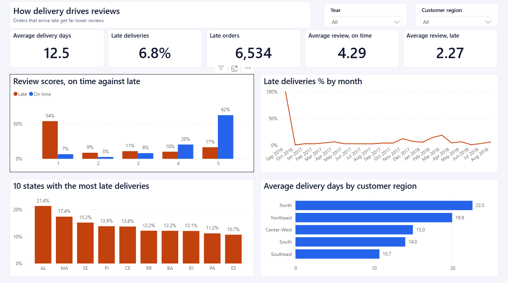

## 🔍 How the numbers are checked

- [`analysis/analysis.ipynb`](analysis/analysis.ipynb) is the source of truth. It applies the rules once, from
  `config/client.yaml`, stops on broken keys or missing lookups, writes the tables Power BI reads, and computes
  every number above.
- [`sql/checks.sql`](sql/checks.sql) computes the main totals again in SQL, straight from the input files; the
  notebook asserts that both agree.
- [`powerbi/06-checks.md`](powerbi/06-checks.md) lists the value every card must show, and the revenue each
  security role must see.

Rules for the demo (keys in `config/client.yaml`): a sale is an item of a delivered order; revenue is the item
price, with freight shown on its own; an order is late when it arrives after the estimated date (dates only); each
order keeps its latest review.

## ▶️ Run it

```bash
pip install -r requirements.txt
```

Put the data files in `data/input/` (see "Data" below), check them, then run the notebook and write the theme:

```bash
python config.py
```

```bash
cd analysis
jupyter nbconvert --to notebook --execute --inplace analysis.ipynb
```

```bash
python theme.py
```

Then build the report with [`powerbi/README.md`](powerbi/README.md).

```
config/client.yaml   every client value: names, file and column names, rules, top-N, colours
config.py            load_config() and the input checks (python config.py)
theme.py             writes powerbi/05-theme.json from the config
data/input/          the input files (only regions.csv is in the repo) and their guide
analysis/            the notebook: health check, model tables, every number, the charts
output/              the tables the notebook writes for Power BI (not in the repo)
sql/                 the SQL cross-check
docs/                the diagrams and charts used here
powerbi/             the report (.pbip) and build_pbip.py, the step-by-step build, the theme, the checks, the screenshots
```

## 🗂️ Data

The [Brazilian E-Commerce Public Dataset by Olist](https://www.kaggle.com/datasets/olistbr/brazilian-ecommerce)
on Kaggle: about 100,000 orders placed on the Olist marketplace from 2016 to 2018, licensed CC BY-NC-SA 4.0.
Amounts are in Brazilian reais. Seven of its files are used (orders, order items, products, sellers, customers,
reviews, category names); the data has no product cost, so the report shows revenue and freight but no margin.

Download it from that page and unzip it into `data/input/`, or with the Kaggle command-line tool:

```bash
kaggle datasets download -d olistbr/brazilian-ecommerce -p data/input --unzip
```

`data/input/regions.csv` (Brazil's 27 states in their five official regions) is ours and is in the repo.
